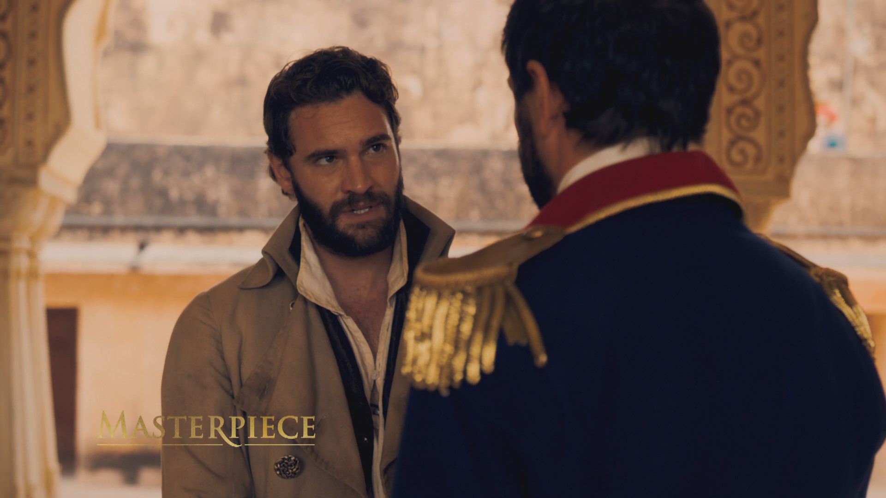
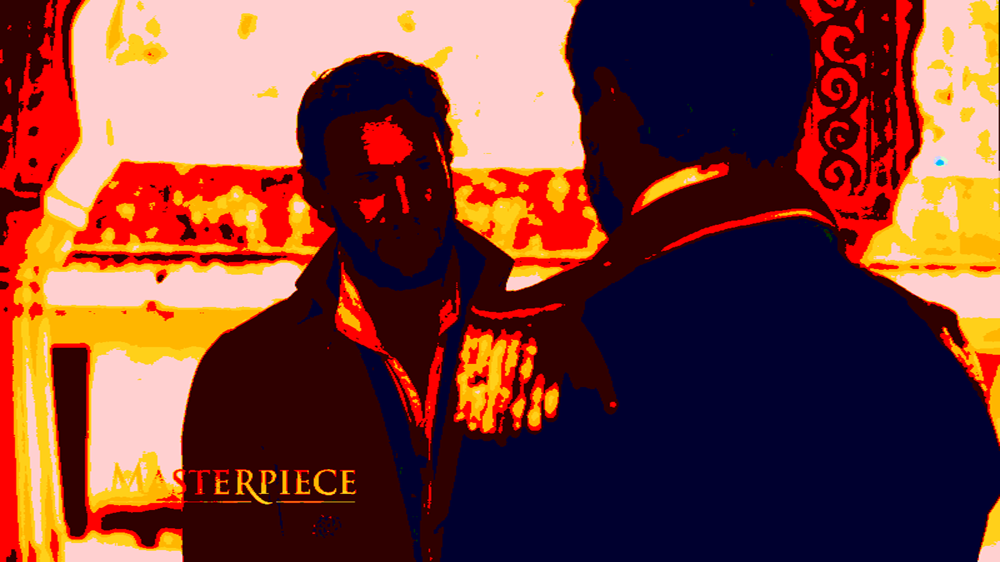
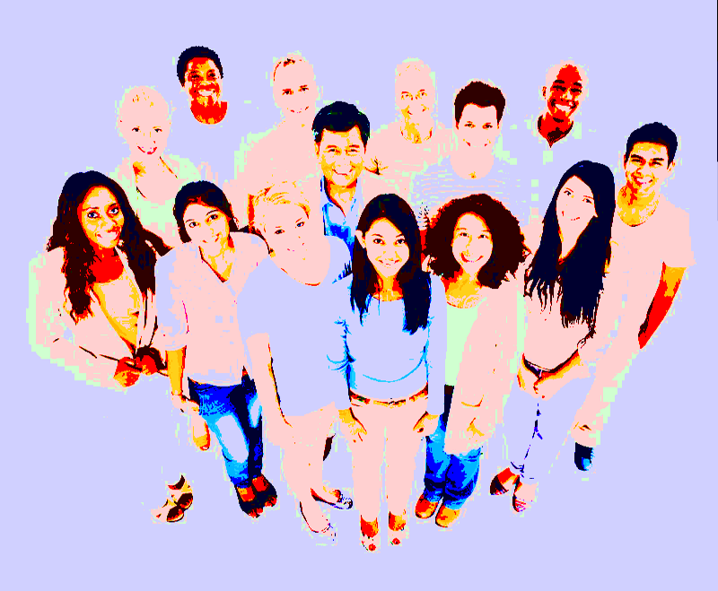
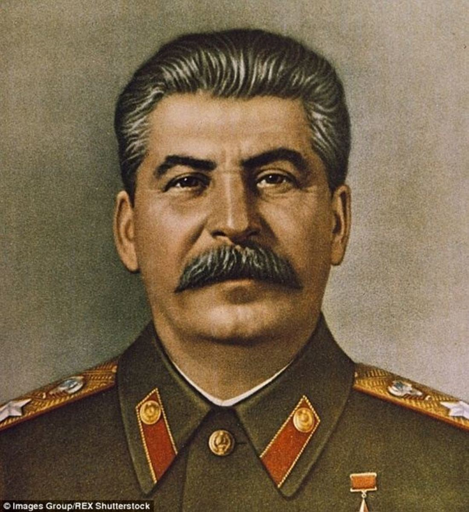
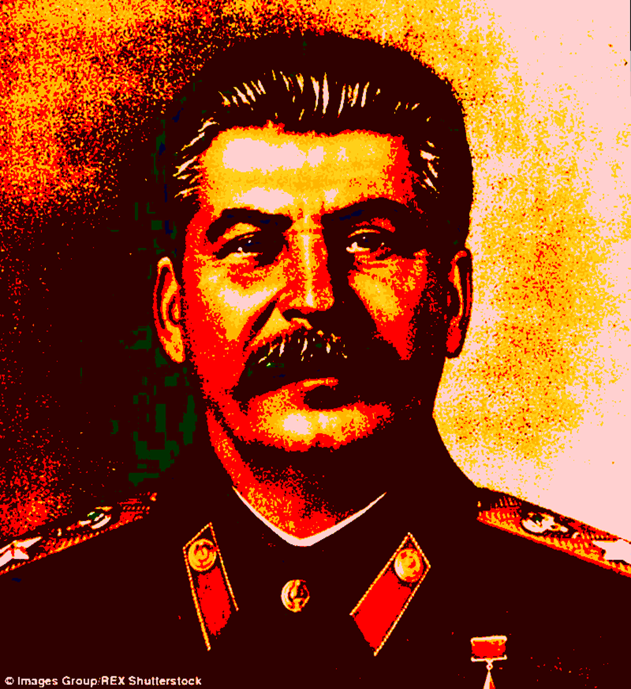

# RestrictPic

RestrictPic restricts the colors in a provided image and then recreates the original image with the restricted colors.

Examples:

Scene from TV Show "Beecham House"

Original

Recreation

Stock Photo

Original

Recreation

Drawing of Joseph Stalin

Original

Recreation
